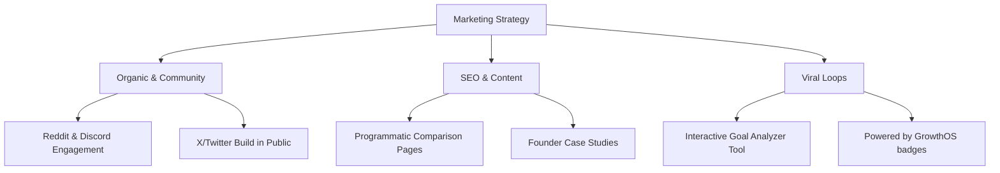

# GrowthOS Comprehensive Marketing Plan

This marketing plan is tailored for **GrowthOS** (the AI Growth Operating System). It outlines the strategy, positioning, messaging, channels, and a 90-day roadmap to acquire the first 1,000 active campaign creators (founders, solopreneurs, and indie hackers) using proven marketing growth loops.

---

## 1. Target Market Analysis

### Primary Audience: The "Build-First" Solopreneur & Indie Hacker
* **Demographics:** Age 22–45, global distribution (concentrated in US, Western Europe, India, and Southeast Asia). Typically solo builders or micro-teams (1–3 people).
* **Psychographics:** High technical aptitude, values speed and automation, hates "traditional marketing fluff" and vanity metrics. Driven by the desire to build, launch, and monetize products quickly. Often suffers from "blank-page syndrome" when marketing.
* **Key Pain Points:**
  * **Lack of marketing expertise:** They know how to write code or design product features, but have no training or comfort in distribution.
  * **Screaming into a void:** They post their product launch on Twitter or Product Hunt to 0 views.
  * **High cost of failure:** They spend months building a product only for it to fail at the marketing stage.
  * **Anxiety and friction:** Feel that traditional marketing is "sleazy" or "spammy" and fear being banned from communities (Reddit/Discord) for self-promotion.
* **Why this segment matters:** This is the most active and fastest-growing segment of software creators. They launch multiple micro-SaaS products a year and desperately need automated, builder-friendly distribution channels.

### Secondary Audience: Early-Stage SaaS Founders & Product Marketers
* **Demographics:** Seed-stage or bootstrapped SaaS startups with 3–15 employees.
* **Psychographics:** Highly metric-driven, constantly looking for new growth loops, values integration and workflow speed.
* **Key Pain Points:**
  * **Slow experiment cycles:** It takes weeks to research, draft, plan, and deploy copy across a new marketing channel.
  * **Limited marketing headcount:** Often have 1 generalist marketer or a founder wearing the marketing hat who is spread too thin.
  * **Disconnected tools:** They design campaigns in Notion, write drafts in Google Docs, manage tasks in Trello, and schedule in another app.
* **Why this segment matters:** They have budget (willing to pay for higher SaaS tiers) and their volume of campaigns is much higher. Successful adoption here leads to team accounts, workspace expansion, and viral referral loops.

---

## 2. Value Proposition & Positioning

### Unique Selling Proposition (USP)
> **"From raw business goal to a live, multi-channel growth playbook in under 2 minutes."**

Unlike generic AI assistants that give high-level, repetitive marketing advice, GrowthOS executes real-time web search to identify active communities, builds a structured execution dashboard of prioritized plans and tasks, and drafts native, value-first copy that is pre-evaluated against community-guideline guardrails.

### Competitive Differentiation
* **Structured Execution vs. Plain Text Outputs:** ChatGPT/Claude outputs a block of text that gets lost in a chat window. GrowthOS writes to a local, persistent database structure (`Campaign -> Goal -> Channels -> Plans -> Todos`) managing your workflow from start to finish.
* **Live Web Search vs. Hallucinated Communities:** GrowthOS runs live web queries to find actual, active target subreddits, Discord groups, and directories, rather than recommending dead or generic platforms.
* **Built-in Compliance & Adversarial Evals:** GrowthOS copywriting agents run through automated check routines (adversarial judges) to guarantee that they disclose builder status and do not fabricate fake user counts, URLs, or testimonials.
* **Integrated Toolbox vs. Standalone Tools:** It connects tool catalogs and sub-agents (UTM generators, image prompt generators, timing planners) directly to the execution cards on your dashboard.

### Positioning Statement
> **For technical founders and indie hackers who struggle to market their products, GrowthOS is the AI-first growth engine that translates high-level business goals into actionable, search-validated campaigns. Unlike manual spreadsheet playbooks or generic AI assistants, GrowthOS handles the research, structures your todos on an interactive dashboard, and drafts native community-compliant copy automatically.**

---

## 3. Core Messaging

### Key Marketing Messages Tailored per Audience

#### For the Solopreneur / Developer
* *The Angle:* Stop building in silence. Get a step-by-step roadmap to your first 100 users.
* *The Message:* "You wrote the code. Now let AI write the playbook. GrowthOS finds your audience and drafts your community posts, so you can launch in your lunch break."

#### For the Growth/Product Marketer
* *The Angle:* Speed up growth experiments by 10x.
* *The Message:* "Automate the research, planning, and asset-drafting stages of your next campaign. Define the goal, approve the channels, and push native copy to production."

### Tone of Voice & Brand Personality
* **Developer-Friendly:** No corporate jargon, "synergy," or vague "growth-hacking" hype. Uses direct, plain language.
* **Empathetic & Collaborative:** Understands that marketing can be scary and stressful; talks like an experienced co-founder who has "been there."
* **Action-Oriented:** Emphasizes doing over thinking. Focuses on concrete steps, tool suggestions, and copy you can paste immediately.
* **Transparent:** Honest about what AI can and cannot do. Admits when it's suggesting best-guess actions versus search-backed facts.

### Taglines & Messaging Angles
* *"The AI marketing team for solo builders."*
* *"Goal in. Campaign out. Zero guesswork."*
* *"Your product deserves to be heard. GrowthOS finds your crowd."*

---

## 4. Marketing Channels & Strategy



### Channel 1: Developer & Founder Communities (Reddit, Indie Hackers, Discord, YC Bookface)
* **Why Chosen:** This is where the primary audience hangs out when they are frustrated with launch results or seeking growth advice.
* **Suggested Content & Strategy (Reddit Marketing #38):**
  * **Valuable "Teardowns":** Write detailed breakdowns of how a successful indie product got its first 1,000 users, and point out how GrowthOS structures that exact campaign.
  * **Community Help (Comment Marketing #44):** Proactively find threads like "How do I market my new dev tool?" and run their product description through GrowthOS, pasting the generated channels and plans directly in the comments.

### Channel 2: X (Twitter) & Build In Public (X Audience #41)
* **Why Chosen:** The "Build in Public" (#buildinpublic, #indiehackers) community is highly active on Twitter. Sharing raw progress, metrics, and screenshots creates high word-of-mouth growth.
* **Suggested Content:**
  * **Feature Shipping & Dev Logs:** Post screenshots of the campaign dashboard, the adversarial evals, and the visual progress rings.
  * **Before/After AI Copywriting Comparisons:** Show how standard Claude/ChatGPT outputs look spammy and how GrowthOS outputs respect community guidelines.

### Channel 3: Programmatic SEO & Side-Project Marketing
* **Why Chosen:** High-intent search queries like "how to market a Next.js app" or "where to post my SaaS" have low organic competition but high conversion value.
* **Suggested Content & Strategy:**
  * **Engineering as Marketing (#15) / Free Tools (#14):** Build a free web-based "Subreddit Finder" at `/tools/subreddit-finder`. It takes their product description, runs the live research agent, and displays active target subreddits with conversion prompts to try GrowthOS.
  * **Competitor Comparison Pages (#11):** Generate public pages comparing GrowthOS to other alternatives (e.g., "GrowthOS vs. Jasper," "GrowthOS vs. ChatGPT prompts," and "GrowthOS vs. Spreadsheet Templates") focusing on structural persistence and search accuracy.

---

## 5. Funnel Strategy

```
  ▲  Awareness: Build-in-public posts, free tools (e.g. Subreddit Finder), and teardowns.
 ───
  ▲  Consideration: Side-by-side prompt comparisons, eval case studies, interactive wizard previews.
 ───
  ▲  Conversion: The "Aha! moment" (Goal in -> Campaigns & Todos out), 3-day trial or free draft.
 ───
  ▲  Retention: Filterable dashboard, daily email digests, automated todo updates.
```

### Awareness Stage
* **Goal:** Drive traffic and developer mindshare.
* **Tactics:** Publish bi-weekly "How [Product X] would launch using AI" walkthroughs on Indie Hackers and Reddit. Launch a mini free tool: `growthos.to/subreddit-finder`.
* **Example Campaign:** *"The Solo Builder's Launch Week Challenge"* — A public challenge where 10 founders use GrowthOS to launch their SaaS in 5 days, tracking their daily todo progress live.

### Consideration Stage
* **Goal:** Convince users that GrowthOS generates real value, not generic AI spam.
* **Tactics:** Document the "Adversarial Evals" setup. Show how the judge agents catch lies, showing builders that the generated copy is safe and premium.
* **Example Campaign:** *"AI vs. Spambots"* — A technical blog post and video showing how traditional AI copy gets you banned on Reddit, while GrowthOS's value-first prompts get upvoted.

### Conversion Stage
* **Goal:** Turn landing page visitors into active campaign creators.
* **Tactics (Onboarding Optimization #96):** An ultra-frictionless onboarding wizard. Let them type their product name and goal on the homepage, showing them a live preview of the Goal Analysis and researched channels *before* forcing signup.
* **Example Campaign:** *"Your First Campaign is on us"* — Let any user generate a full 3-channel, 15-todo campaign draft for free, locking only the copywriter and advanced sub-agents behind a login/paywall.

### Retention Stage
* **Goal:** Ensure builders return to complete their todos and run new campaigns.
* **Tactics:**
  * Filterable, rewarding dashboard UI with confetti on todo completion.
  * **Founder Welcome Email (#47) & Onboarding Emails (#51):** Connect founders with a personal email showing how to run their first custom sub-agent.
  * **Toolbox updates:** Notify users when new tools are added to the catalog that fit their plans.

---

## 6. Two-Week Content Calendar

This sample calendar is designed for the launch phase, focusing on organic developer channels.

| Day | Channel | Format | Theme / Topic | Key KPI |
|-----|---------|--------|---------------|---------|
| **Mon 1** | X (Twitter) | Text + Image | **Hook:** "I spent 48 hours building an AI that does web search to find where your SaaS audience hangs out. Here is what it found for a React Native app." | Clicks to wizard |
| **Wed 1** | Indie Hackers | Text Post | **Deep Dive:** "Why standard ChatGPT marketing plans fail: An analysis of structured data vs. long-form text blocks." | Account Signups |
| **Fri 1** | Reddit (r/SaaS) | Value Post | **Case Study:** Walkthrough of a mock launch for a developer tool. Include raw prompt, raw channels found, and the actual native copy written. | Upvotes / Traffic |
| **Mon 2** | X (Twitter) | Thread | **Behind-the-scenes:** "How we built the 'Adversarial Judge' to make sure our AI doesn't lie or fabricate statistics in posts." | Retweets / Link visits |
| **Wed 2** | Substack/Blog | Newsletter | **Educational:** "The 4 Forces of Switching Dynamics: Why developers refuse to market and how to break the habit loop." | Email Subscribers |
| **Fri 2** | Product Hunt | Launch Post | **Product Launch:** Official GrowthOS launch. Share the story, screenshots, and promo code. | Upvotes / Badges |

---

## 7. Growth & Acquisition Strategy

### Organic vs. Paid Strategy
* **Organic (90% Focus):** Build in public, SEO, and community integration. This is sustainable, builds trust with developer audiences, and keeps customer acquisition costs (CAC) near $0.
* **Paid (10% Focus):** Retargeting ads on X (Twitter) and Google Search for high-intent keywords (e.g., "how to launch on Product Hunt", "Reddit marketing tool").

### Viral / Referral Opportunities (Viral Loops #93 & Two-Sided Referrals #137)
* **"Share my Roadmap" loop:** Allow builders to generate a public link to their campaign dashboard (e.g., `growthos.to/share/dave-launch`). When they share their progress on Twitter/Reddit, others click the link, see the clean dashboard interface, and click "Build my own campaign."
* **"Powered by GrowthOS" badges (#87):** When using the copywriting agent to post on directories or communities, append a subtle, optional footer note: *(Planned via GrowthOS)*. Clicking it redirects to our homepage with a referral token attached.
* **Invite-to-Unlock Loop:** Grant users additional advanced agent credits (e.g., extra live-search updates or launch-timing recommendations) for every builder they refer who successfully creates and saves a campaign dashboard.

### Partnerships & Integrations
* **Directory Partners:** Partner with directories (like StartupPedia, Microns, or Betalist) to offer one-click submission integration directly from the GrowthOS todo card.
* **Integration Marketing (#63):** Co-market with integration tools listed in the tool catalog (e.g., Supabase, Screenity). Write joint launch playbooks demonstrating how to build with their tools using GrowthOS campaign tasks.
* **Open Source as Marketing (#123) / Developer Relations (#136):** Open-source the core parsing rules, system schemas, or a Next.js campaign boilerplate to drive developer contributions and high-trust organic backlinks on GitHub.

---

## 8. Budget Allocation

Based on a low-to-medium bootstrap budget ($1,000/month initial spend, excluding software overhead).

```
   ┌───────────────────────────────────────────────────────────┐
   │ 40% - Free Tool Marketing & Side-Projects (Hosting & APIs)│
   ├───────────────────────────────────────────────────────────┤
   │ 30% - Community Sponsorships (Newsletters/Subreddits)    │
   ├───────────────────────────────────────────────────────────┤
   │ 20% - Retargeting Ads (X/Google Search)                   │
   ├───────────────────────────────────────────────────────────┤
   │ 10% - Design & Visual Assets                              │
   └───────────────────────────────────────────────────────────┘
```

* **Free Tool Marketing & Side-Projects ($400/month):** API credits (Anthropic web search, image generation) to power free preview wizards on the landing page.
* **Niche Newsletter Sponsorships ($300/month):** Sponsor developer-focused newsletters (like TLDR, Indie Hackers weekly, or stack-specific letters) with direct text links.
* **Retargeting Ads ($200/month):** X/Twitter retargeting campaigns targeting people who visited the `/new` form page but didn't sign up.
* **Design/Visuals ($100/month):** High-quality screenshots, custom graphics, and social headers.

---

## 9. KPIs & Metrics

| Stage | Metric | Target (Month 1-3) | Tracking Tool |
|-------|--------|---------------------|---------------|
| **Acquisition** | Unique Landing Page Visitors | 10,000 / month | Plausible / PostHog |
| **Activation** | Campaign Generation Rate | > 25% of visitors | Supabase / PostHog |
| **Execution** | Average Todos Completed / User | > 5 completed | Supabase Database |
| **Retention** | 30-Day Dashboard Return Rate | > 35% | PostHog Cohorts |
| **Virality** | Referral Signups | 15% of total signups | Custom invite links |

---

## 10. Action Plan (90-Day Execution Roadmap)

### Phase 1: Days 1–30 (Foundation & Alpha Testing)
* **Goal:** Launch the core flow, finalize the positioning document, and acquire the first 50 beta users.
* [ ] Deploy the v2 wizard flow (Goal Analyzer -> Channel Research -> Plan/Todo Generation -> Dashboard).
* [ ] Integrate the curated tool catalog (seeded with 20 developer/marketing tools).
* [ ] Launch a private alpha for 50 indie hackers via Twitter DMs. Gather raw testimonials and look for bugs in the search research agent.
* [ ] Build and deploy the programmatic `/toolbox` page.
* [ ] Embed the **"Powered by GrowthOS"** footer link generation in the copywriting tool options (#87).

### Phase 2: Days 31–60 (Side-Project Launch & SEO)
* **Goal:** Create awareness and drive high-intent organic search traffic.
* [ ] Spin out the "Subreddit Finder" as a standalone, free page at `/tools/subreddit-finder` that runs the web search agent (#15).
* [ ] Deploy the competitor comparison pages for "GrowthOS vs. ChatGPT Prompts" and "GrowthOS vs. Notion Templates" (#11).
* [ ] Submit GrowthOS to 30+ AI and developer directories.
* [ ] Publish the "Adversarial Evals" case study on Hacker News, Dev.to, and Medium.
* [ ] Set up retargeting pixels and configure a simple email digest to nudge users to check off pending todos.

### Phase 3: Days 61–90 (Public Launch & Viral Loops)
* **Goal:** Publicly launch on Product Hunt and scale to 1,000 active campaigns.
* [ ] Implement the "Share my Roadmap" public dashboard page.
* [ ] Release the open-source boilerplate wrapper on GitHub to drive developer relations (#123, #136).
* [ ] Run "The Solo Builder's Launch Week Challenge" with 10 selected founders.
* [ ] Launch officially on Product Hunt, Hacker News, and X.
* [ ] Ship one-click directory submission from todo cards (prefilled hand-off; the user confirms and posts — no fabricated auto-submit or auto-publish).
* [ ] Review Month 3 analytics, optimize conversion funnels, and prepare v3 subscription tiers.
